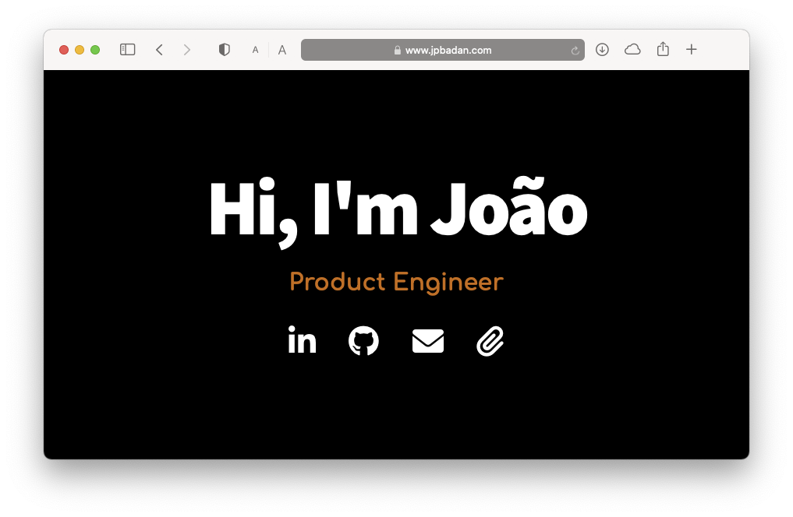

# Personal Landing Page

 

### A simple and minimal landing page for myself. [Live preview](https://jpbadan.com)

## Why?

I wanted simple landing page to showcase my contact information and my resume. I wanted it to be minimal and right to the point rather beautiful and hefty. 

The final product is simple, and easily customizable.

## Deploy

GitHub makes it easy to create personal websites. Follow this link - [GitHub Pages](https://pages.github.com/) to know how or follow the steps below.

If you already have a GitHub profile:

* Create a new repo with the name `{username}.github.io`
* Clone/Fork this repo and copy the files to your newly created repo
* Customize your name, links and everything else for your landing page
* `git push`

Voila! Your site should be live at `https://{username}.github.io`

If you want to make your new landing page available under a domain like `{username}.com` you can get started here - [Setting up a custom domain](https://help.github.com/articles/quick-start-setting-up-a-custom-domain/).

Here's my own **Personal Landing Page** - [jpbadan.com](https://jpbadan.com)

## Tips

During this project I discovered [Real favicon generator](https://realfavicongenerator.net) which was a real time saver when dealing with favicons for multiple browsers

## License

_Made with ❤️ in Toulouse 🛫_
